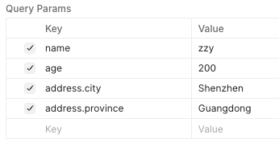
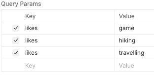
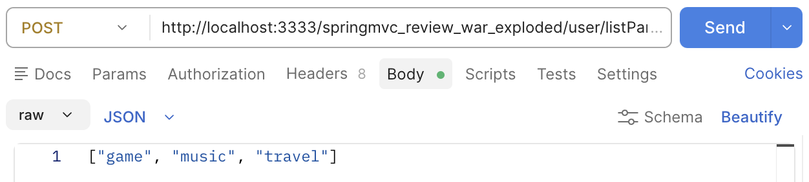
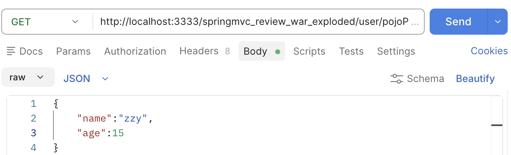
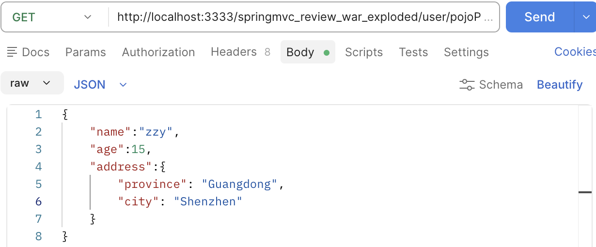
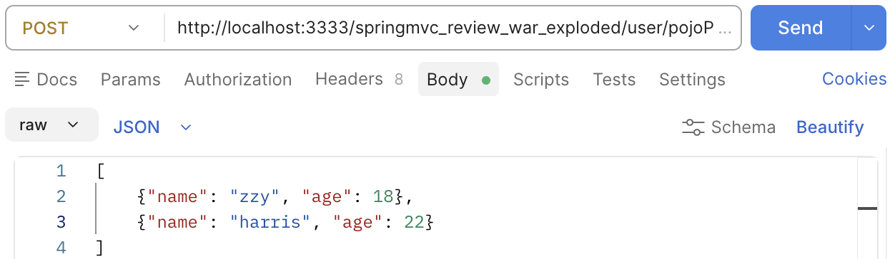

# 特殊参数传递

> *有的时候驴唇不对马嘴*
> 

# 1. 使用注解标注

用`@RequestParam("name")` 这样在HTTP请求的时候就可以设置key为name就会映射到router内的`user_name`

```java
@RequestMapping("/commParam")
@ResponseBody
public String commParam(@RequestParam("name") String user_name, int age) {
    System.out.println("name == " + user_name + " age == " + age);
    return "{'module': 'commParam'}";
}
```

# 2. 传入的是一个类

如果属性名是一样的，会自动塞进来

```java
// POJO param
@RequestMapping("/pojoParam")
@ResponseBody
public String pojoParam(User user) {
    System.out.println("pojo param: user: " + user);
    return "{'module': 'pojo param'}";
}
```

# 3. 嵌套的数据类

当前我们做好了一个`Address`类，然后放入到`User`中

```java
public class Address {
    private String province;
    private String city;

    public Address(String province, String city) {
        this.province = province;
        this.city = city;
    }
    
}

public class User {
    private String name;
    private int age;
    private Address addr;   
}
```

在controller中还是一样调用

```java
@RequestMapping("/containPojoParam")
@ResponseBody
public String containPojoParam (User user) {
    System.out.println(user.toString());
    return "{'module': 'contain pojo param'}";
}
```



# 4. 传入数组信息

比如说传入多个爱好

```java
@RequestMapping("/arrayParam")
@ResponseBody
public String arrayParam(String[] likes) {
    System.out.println(Arrays.toString(likes));
    return "{'module': 'arrayParam'}";
}
```

在发请求时：



# 5. 传入集合

```java
@RequestMapping("/listParam")
@ResponseBody
public String listParam(@RequestParam List<String > likes){
    System.out.println(likes);
    return "{'module': 'list param'}";
}
```

要使用`@RequestParam` 进行注解

# 6. JSON 格式的传递

## 6.1 JSON集合参数

记得要在`pom.xml`安装`JSON`依赖

```xml
<dependency>
    <groupId>com.fasterxml.jackson.core</groupId>
    <artifactId>jackson-databind</artifactId>
    <version>2.15.0</version>
</dependency>
```

在controller中

```java
// JSON param
@RequestMapping("/listParamForJson")
@ResponseBody
public String listParamForJson(@RequestBody List<String> likes) {
    System.out.println("JSON Param: " + likes);
    return "{'module': 'JSON Param'}";
}
```

postman 发请求



## 6.2 POJO参数JSON格式

在controller中

```java
// JSON POJO class
@RequestMapping("/pojoParamForJson")
@ResponseBody
public String listParamForJson(@RequestBody User user) {
    System.out.println("JSON Param: " + user);
    return "{'module': 'JSON Param'}";
}
```

但是注意我们前面修改过了`User`类，在`User`类和`Address`类中要有空的构造方法，不然程序会崩溃

在postman中还是一样写json格式进行调试。

但是在这里没有传入`address`，在terminal里面是`null`



传入带`address`类如下



## 6.3 JSON list

```java
// JSON POJO list
@RequestMapping("/pojoParamList")
@ResponseBody
public String listParamForJson3(@RequestBody List<User> users) {
    System.out.println("JSON Param: " + users);
    return "{'module': 'JSON Param'}";
}
```

postman 发请求


